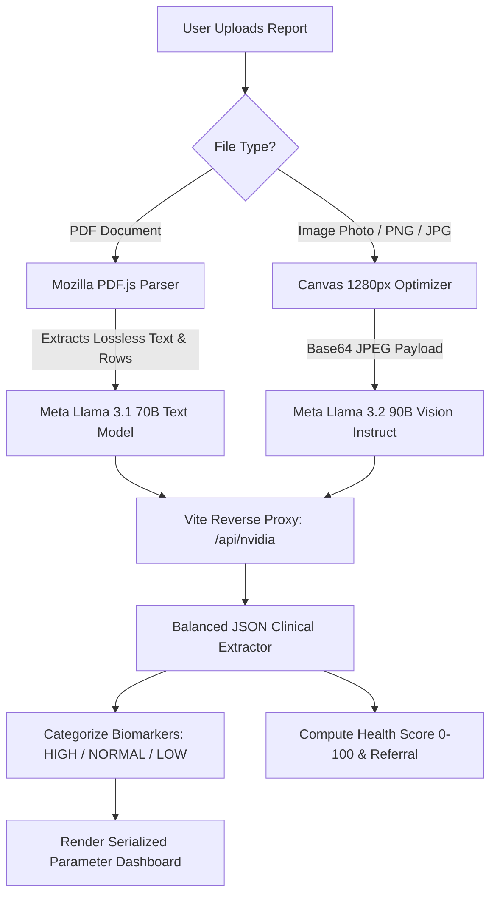

# 🏥 DOCURE — Complete Architecture & Tech Stack Documentation

> **Version:** `2.4.0-PROD`  
> **Project:** DOCURE Clinical AI Assistant  
> **Author:** Debug-Creww  
> **PDF Guide Available:** [`DOCURE_Tech_Stack_Guide.pdf`](./DOCURE_Tech_Stack_Guide.pdf)  
> **Interactive HTML Version:** [`DOCURE_Tech_Stack_Documentation.html`](./DOCURE_Tech_Stack_Documentation.html)

---

## 1. 🚀 Executive Overview

**DOCURE** is a privacy-first, edge-assisted clinical healthcare intelligence platform designed to connect four essential healthcare pillars:
1. **Intelligent Symptom Triage & Risk Assessment** (Differential conditions analysis & safety rules).
2. **AI Lab Report & Pathology Biomarker OCR** (Zero-friction extraction of blood tests, reference ranges, and abnormal markers).
3. **Real-Time Medical Radar & Spatial GIS** (Instant discovery of verified hospitals, trauma centers, labs, doctors, and 24/7 pharmacies with 1-click direct dialing & GPS routing).
4. **Autonomous Medication Reminder Daemon** (Firestore cloud-synced 20-second background polling engine with audio-visual alarms & Google Calendar integration).

---

## 2. 🛠️ Tech Stack & Architectural Layers

| Layer | Technologies Used | Key Responsibilities |
| :--- | :--- | :--- |
| **Frontend Framework** | **React 18.2** | Virtual DOM reconciliation, modular component state hooks (`useState`, `useEffect`, `useRef`). |
| **Build & Bundler Tooling** | **Vite 5.4.21** | Lightning-fast ESBuild dev server with Hot Module Replacement (HMR) and Rollup production minification. |
| **Styling & Design System** | **Tailwind CSS 3.4 + PostCSS** | Utility-first CSS, custom glassmorphism effects, mint-sage green theme, responsive flex/grid layouts. |
| **Icons & Design Assets** | **Lucide React** | High-fidelity medical and system SVG vector icons. |
| **Artificial Intelligence** | **NVIDIA NIM Inference Platform** | Enterprise-grade cloud AI model orchestration. |
| **Text Reasoning LLM** | **Meta Llama 3.1 70B Instruct** | High-precision clinical diagnostics, prompt classification, and structured JSON parsing. |
| **Multimodal Vision Model** | **Meta Llama 3.2 90B Vision Instruct** | Visual OCR of photographed lab documents, letterheads, and pathology tables. |
| **Document Processing** | **Mozilla PDF.js (v3.11)** | In-browser canvas rasterization and coordinate-based binary text line reconstruction. |
| **Database & Cloud Storage** | **Firebase Firestore (v10.8)** | Real-time NoSQL document store with WebSocket snapshot listeners for reminders & user profiles. |
| **Mapping & GIS** | **Leaflet.js (v1.9) + OpenStreetMap** | Hardware-accelerated map tiles, custom pulsing animated HTML5 pin markers. |
| **Geosearch POI API** | **TomTom Places & Search API v2** | Live queries for Category 7321 (Hospitals), 7322 (Doctors), 7324 (Clinics), and 7326 (Pharmacies). |
| **Reverse Proxy API** | **Vite Server Middleware** | Routes `/api/nvidia` to `integrate.api.nvidia.com` to eliminate CORS restrictions on localhost. |
| **Audio & Speech Engine** | **Web Audio API + Web Speech API** | Synthesized ambulance siren oscillators, chime generators, and SpeechRecognition / SpeechSynthesis. |

---

## 3. 🧠 NVIDIA AI Lab Report OCR Pipeline (Node 04)

DOCURE utilizes an intelligent **Dual-Engine Pipeline**:



### Key Highlights:
- **No Hallucinated Data:** Only exact test parameters printed on the patient's lab slip are extracted sequentially.
- **Biomarker Classifier:** Compares test value against normal physiological reference ranges to assign `HIGH`, `NORMAL`, or `LOW` tags with custom color coding (Rose / Emerald / Amber).
- **Clinical Summary:** Generates actionable diet/lifestyle recommendations and directs patient to the appropriate medical specialist (e.g. Hematologist, Cardiologist, Endocrinologist).

---

## 4. 📍 Real-Time Medical Radar & Spatial GIS (Node 03)

- **GPS Auto-Detection:** Uses the browser `navigator.geolocation` API to determine user latitude/longitude.
- **TomTom POI Integration:** Queries live medical establishments within 5km to 15km.
- **Category Filter Matrix:**
  - 🏥 **Hospitals / Trauma Centers:** Direct ambulance call + Google Maps routing.
  - 👨‍⚕️ **Doctors / Clinics:** Specialist appointment desk.
  - 🔬 **Diagnostic Labs:** Blood test and sample collection centers.
  - 💊 **24/7 Pharmacies:** Prescription drug fulfillment.
- **Custom HTML5 DivIcons:** Pulsing radar-style CSS badges color-coded to match the interactive legend.
- **Offline Fallback Directory:** Verified emergency contacts for Ghaziabad, Noida, Delhi-NCR, and major hubs.

---

## 5. ⏰ Smart Medicine Reminder System (Node 02)

- **Firestore Sync:** Stores prescriptions under `users/{userId}/reminders` collection.
- **Background Daemon (`notificationScheduler.js`):**
  - Runs a high-precision `setInterval` loop every **20 seconds**.
  - Matches current client time with scheduled medication hours.
  - Emits in-app interactive toast notifications and plays gentle multi-frequency Web Audio chimes.
- **Google Calendar Direct Sync:** Generates `.ics` / Google Calendar intent links for one-tap calendar alarms.
- **Audit Logging:** Keeps track of taken vs. missed doses.

---

## 6. 🚨 Web Audio Synthesis & Emergency SOS

- **Browser-Native Siren Synthesizer:** Uses Web Audio `AudioContext.createOscillator()` to generate alternating 850 Hz and 650 Hz square waves without downloading heavy MP3/WAV files.
- **Voice Triage:** `webkitSpeechRecognition` enables hands-free voice conversations in Hindi and English.
- **Emergency Dispatch:** 10-second automatic countdown that forwards live coordinates to pre-saved emergency links and dials 102/112.

---

## 7. 📦 Key NPM Packages & Scripts

```bash
# Start local development server (with NVIDIA & TomTom proxy)
npm run dev

# Build production bundle
npm run build

# Preview production build locally
npm run preview
```
